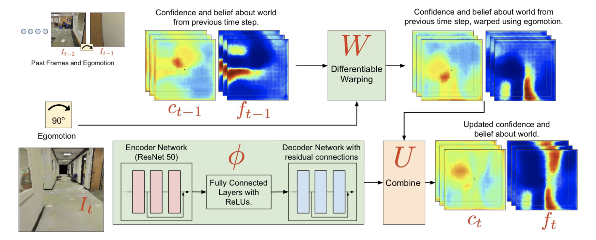
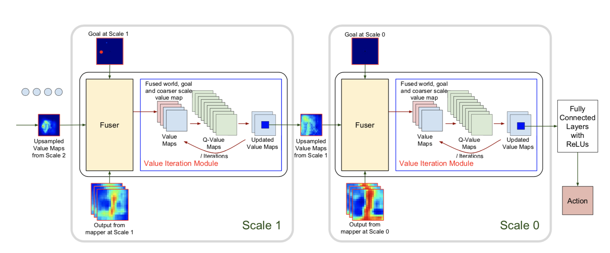
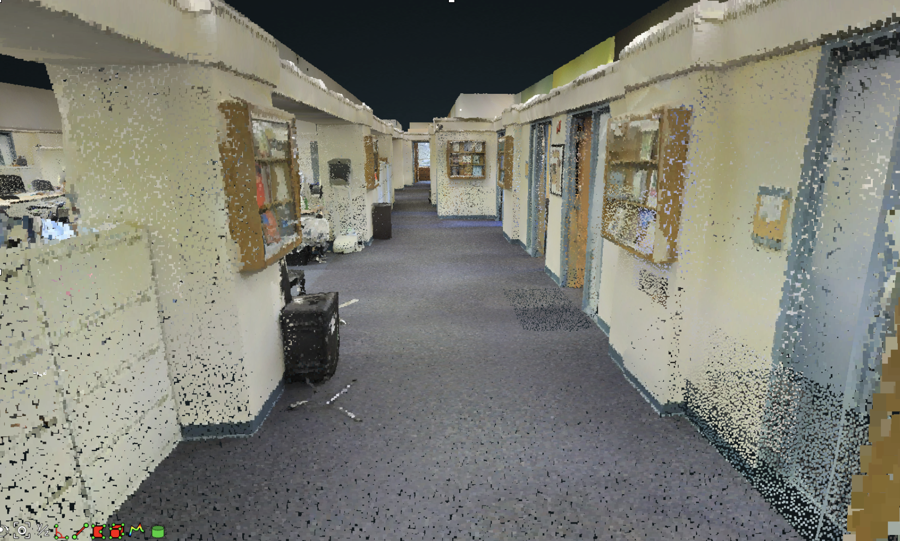
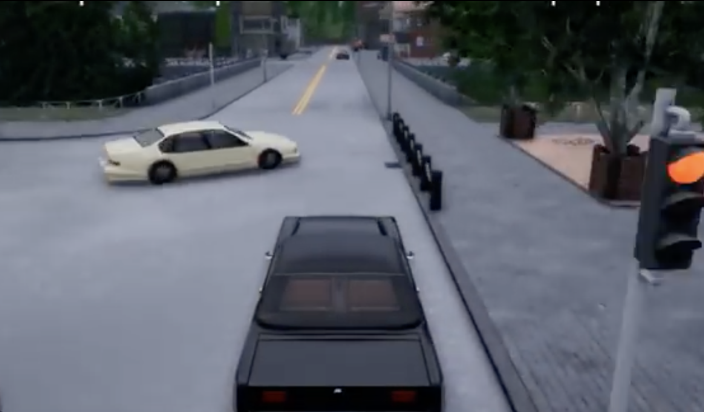

# Cognitive Mapping and Planning on CARLA

> Adaptation of S. Gupta’s 2017 paper to CARLA

<!--###Motivation

> TODO
-->

### Architecture

> ###### Architecture of Mapper
> 
> 

---

> ###### Architecture of Hierarchical Planner
> 
> 

### Differences
#### Environment Differences

The original environment is the Stanford large-scale 3D Indoor Spaces (S3DIS) dataset. The dataset consists of 3D scans (in the form of textured meshes) collected in 6 large-scale indoor areas that originate from 3 different buildings of educational and office use.

Our environment is CARLA, an open-source simulator for autonomous driving research.

- Environment types:
	- Grid-world environment
	- Realistic environment
- Action space:
	- Discrete movements and strict perpendicular rotations
	- Continuous movements and rotation controlled by three variables: steer, throttle and brake
- Distance:
	- Within 40 steps
	- Within 80 frames when fps = 2

#### Architecture Differences

The last softmax layer to output probabilities of actions is removed. The range of steer is [-1.0, 1.0] and the range of throttle and brake is [0.0, 1.0]. So the function tanh is applied to steer and the function sigmoid is applied to throttle and brake. 

The planner operates at multiple scales of the problem which leads to efficiency in planning. It allows us to plan for goals which are as far as $l*2^k$ steps away while performing only $lk$ planning iterations. Because the number of steps is increased to 80, the value iteration network needs modification. Instead of a 3-scale hierarchical planner with 8 iterations in each scale, we increased the number of iterations to 10 in each scale to plan for goals that needs $2^3*10=80$ steps to reach. 

The expert actions are given by CARLA. 

DAGGER is used for training.

### Training Result

It should be able to go straight/turn left/turn right at the intersection, but it seemed that it only learned a policy to follow the lane to go straight. The reward map has little effect.

> ###### Goal reward images at different scales: 
> 
> 

> 
> 
> 
> 

> It shows relative goal location to the agent and assumes the agent is at center.

----

<!--
> ######Free space maps: 
> TODO

----

> ######Value maps: 
> TODO
-->

### Explanation

I think there could be serveral reasons to explain why it could not learn to turn left/right using this architecture. 

- Because carla is not a grid-world environment and the translation and the rotation of vehicles are continuous, then there are too many states. But our value iteration network could not support so many states, so it will have little effect. Even though through VIN we can roughly determine the next state, it is not easy or even impossible to control the vehicle to go there.

- Between every two frames, the egomotion is too small to affect the free space maps and confidence maps.

<!--
- We could increase the percentage of in the dataset.
-->

<!--1. Too many states, value iteration does not have any effect. Even though 计算出来下一个点应该到哪里，其实也无法将车开到那个位置
2. 转向这件事情由于并非90度转弯，

4. Datasets的问题 
-->

### Next Step:

- Increase the ratio of turning in the datasets.
- Replace VIN with CIL
	- Problem: How to use the output of the mapper
- Adapt to CARLA to 0.9.0
